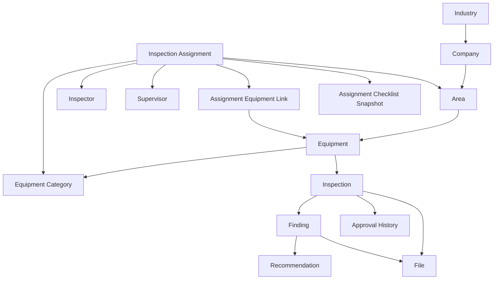
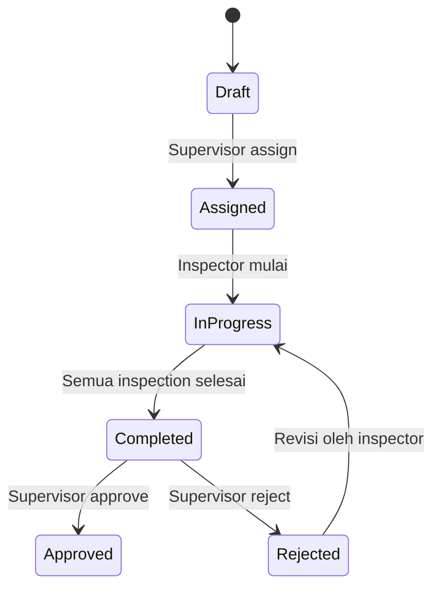
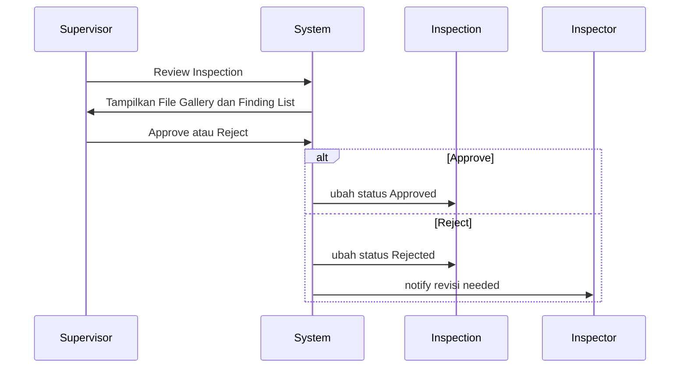
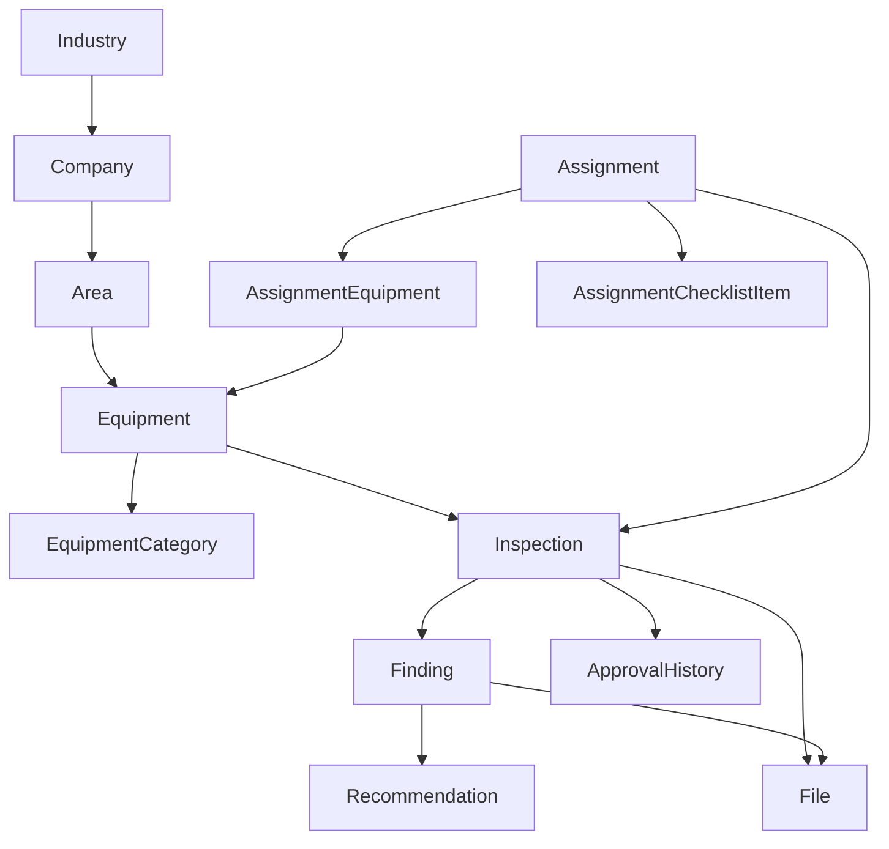

# Business Flow Documentation

## 1. Tujuan
Dokumentasi ini menjelaskan alur bisnis utama refactor aplikasi Industrial Survey & Inspection menjadi berbasis organisasi industri dengan Clean Architecture. Dokumen ini menegaskan model domain, alur assignment dan inspection, bukti inspeksi, audit, template checklist, serta dashboard yang dibutuhkan untuk MVP.

## 2. Struktur Domain

Struktur domain organisasi baru mengikuti hirarki utama:

Industry -> Company -> Area -> Equipment -> Inspection -> Finding -> Recommendation -> File

`InspectionAssignment` adalah penugasan yang menghubungkan Area, Category, Inspector, Supervisor, dan banyak Equipment.



### 2.1 Entitas utama

- `Industry`
- `Company`
- `Area`
- `Equipment`
- `EquipmentCategory`
- `InspectionAssignment`
- `AssignmentEquipment` atau `InspectionTask` (bridge antara Assignment dan banyak Equipment)
- `Inspection`
- `Finding`
- `Recommendation`
- `File`
- `InspectionTemplate`
- `InspectionTemplateItem`
- `AssignmentChecklistItem`
- `ApprovalHistory`

## 3. Role Responsibilities

| Role | Tanggung Jawab Utama |
|---|---|
| Super Admin | User, Role, Permission, Category, Konfigurasi Sistem |
| Admin | Industry, Company, Area, Monitoring Equipment, Assignment, Reporting, Analytics |
| Supervisor | Membuat Assignment, Pilih Category/Area/Inspector, Review, Approve/Reject |
| Inspector | Menjalankan Assignment, input Equipment, checklist, temuan, file, submit |

## 4. Lifecycle Assignment dan Inspection

### 4.1 Alur Assignment

Supervisor membuat atau mengelola assignment:

- Assignment dibuat dalam status `Draft`
- Supervisor menetapkan `Industry`, `Company`, `Area`, `Category`, `Inspector`, `Supervisor`, `Due Date`
- Assignment mengambil `category_id` sebagai fokus kategori equipment yang diperiksa
- Assignment dapat dikaitkan ke banyak equipment melalui `assignment_equipments`
- Assignment bergerak ke `Assigned` saat siap
- Inspector mulai melakukan inspection -> `In Progress`
- Ketika semua inspection yang terkait selesai, assignment menjadi `Completed`
- Supervisor review dan `Approve` atau `Reject`



### 4.2 Relasi Assignment dan Inspection

- `InspectionAssignment` adalah entitas penugasan dan bukan induk equipment.
- Assignment dapat berisi banyak equipment melalui `assignment_equipments` atau `inspection_tasks`.
- Setiap `Inspection` harus memiliki `assignment_id` dan `equipment_id`.
- `Equipment` menyimpan `industry_id`, `company_id`, `area_id`, dan `category_id`.
- `InspectionAssignment` menyimpan `category_id` untuk menetapkan jenis equipment yang menjadi fokus tugas.
- Desain ini menghindari duplikasi equipment saat inspeksi berkala dilakukan.

### 4.3 Assignment Checklist Snapshot

- Assignment menyalin checklist dari `InspectionTemplate` ke `assignment_checklist_items` saat dibuat.
- Dengan snapshot tersebut, hasil checklist historis tetap konsisten meski template berubah.
- Ini memastikan audit masa lalu tetap valid saat memeriksa inspection lama.

### 4.4 Inspection Result

Inspection harus menyimpan hasil pemeriksaan sebagai sumber dashboard:

- `result` (`LAIK`, `TIDAK_LAIK`, `PERLU_PERBAIKAN`)
- `notes`
- `status`

## 5. Inspection Evidence Management

### 5.1 Alur dokumentasi inspeksi

Inspector mengikuti alur berikut saat mengerjakan assignment:

1. Buka `Inspection Assignment`
2. Pilih atau input `Equipment` terkait
3. Isi checklist inspeksi dari snapshot task
4. Upload bukti media untuk inspection (minimal 1 file)
5. Tambah `Finding` jika ada
6. Upload file untuk setiap `Finding`
7. Submit inspection jika validasi terpenuhi

```mermaid
flowchart TD
  A[Mulai Assignment] --> B[Pilih Equipment]
  B --> C[Isi Checklist]
  C --> D[Upload File Inspeksi]
  D --> E{Ada Finding?}
  E -- Ya --> F[Tambah Finding]
  F --> G[Upload File Finding(s)]
  G --> H{Tambah Finding lagi?}
  H -- Ya --> F
  H -- Tidak --> I[Submit Inspection]
  E -- Tidak --> I
```

### 5.2 Validasi Submit Inspection

Inspector hanya boleh submit jika:

- Ada minimal 1 file terkait `Inspection`
- Ada minimal 1 temuan (`Finding`) atau inspection tanpa temuan yang valid
- Jika ada temuan:
  - `title` wajib
  - `description` wajib
  - minimal 1 `Recommendation` atau minimal 1 file finding

## 6. Model Data Utama

### 6.1 Equipments

- `equipments`
  - `id`
  - `industry_id`
  - `company_id`
  - `area_id`
  - `category_id`
  - `unit_number`
  - `serial_number`
  - `equipment_name`
  - `brand`
  - `model`
  - `capacity`
  - `status`

### 6.2 Inspection Assignments

- `inspection_assignments`
  - `id`
  - `industry_id`
  - `company_id`
  - `area_id`
  - `category_id`
  - `inspector_id`
  - `supervisor_id`
  - `due_date`
  - `status` (`Draft`, `Assigned`, `In Progress`, `Completed`, `Approved`, `Rejected`)

### 6.3 Assignment Equipment Link

- `assignment_equipments`
  - `id`
  - `assignment_id`
  - `equipment_id`
  - `assigned_at`

### 6.4 Inspections

- `inspections`
  - `id`
  - `assignment_id`
  - `equipment_id`
  - `inspection_date`
  - `result` (`LAIK`, `TIDAK_LAIK`, `PERLU_PERBAIKAN`)
  - `notes`
  - `status`
  - `created_by`
  - `created_at`
  - `updated_at`

### 6.5 Findings

- `findings`
  - `id`
  - `inspection_id`
  - `title`
  - `description`
  - `severity` (`Low`, `Medium`, `High`, `Critical`)
  - `status` (`Open`, `Monitoring`, `Closed`)
  - `created_by`
  - `created_at`
  - `updated_at`

### 6.6 Recommendations

- `recommendations`
  - `id`
  - `finding_id`
  - `description`
  - `status`
  - `target_date`
  - `created_at`

### 6.7 Media & File Management

Semua media berasal dari modul `File Management` untuk mendukung foto, video, PDF, dan dokumen pendukung.

- `files`
  - `id`
  - `entity_type` (`inspection`, `finding`, `equipment`, dll.)
  - `entity_id`
  - `media_type`
  - `path`
  - `thumbnail_path`
  - `mime_type`
  - `size`
  - `created_at`

### 6.8 Inspection Templates

- `inspection_templates`
  - `id`
  - `category_id`
  - `name`
  - `created_at`

- `inspection_template_items`
  - `id`
  - `template_id`
  - `item_name`
  - `is_required`
  - `order_number`
  - `created_at`

### 6.9 Assignment Checklist Snapshot

- `assignment_checklist_items`
  - `id`
  - `assignment_id`
  - `template_item_id`
  - `item_name`
  - `is_required`
  - `order_number`
  - `created_at`

### 6.10 Approval History

- `inspection_approvals`
  - `id`
  - `inspection_id`
  - `action` (`SUBMITTED`, `APPROVED`, `REJECTED`, `REVISED`)
  - `comment`
  - `performed_by`
  - `created_at`

## 7. Dashboard dan Menu

### 7.1 Dashboard Metrics

- Super Admin:
  - Total User
  - Total Category
  - Total Inspection
- Admin:
  - Total Industry
  - Total Company
  - Total Area
  - Total Inspection
  - Inspection by Company
  - Inspection by Area
  - Inspection by Category
- Supervisor:
  - Assignment Pending
  - Assignment Progress
  - Inspection Waiting Approval
  - Critical Findings
  - Overdue Assignment
  - Open Recommendation
- Inspector:
  - My Assignment
  - Completed Assignment
  - Pending Assignment

### 7.2 Sidebar Menu

- Super Admin: Dashboard, Users, Roles, Categories, Settings
- Admin: Dashboard, Industries, Companies, Areas, Assignments, Reports
- Supervisor: Dashboard, Assignments, Review Inspections, Reports
- Inspector: Dashboard, My Assignments, My Inspections

## 8. Clean Architecture dan Implementasi

### 8.1 Batasan tanggung jawab

- Business logic tidak ditaruh di `Controller`
- Gunakan `Repository` untuk akses data
- Gunakan `DTO` untuk transfer data antar layer
- Gunakan `Use Case` untuk aturan bisnis
- Gunakan `Service` untuk orkestrasi dan integrasi
- Gunakan `Policy` untuk otorisasi

### 8.2 Kompatibilitas File Management

- Semua media disimpan lewat modul `File Management`
- `files` menjadi abstraksi utama untuk foto, video, PDF, dan dokumen
- `File Management` membuat struktur future-ready tanpa mengubah business logic

## 9. Alur Review dan Approve

Supervisor melakukan review setelah inspector submit:

- Buka inspection hasil submit
- Tinjau media inspection, finding, dan recommendation
- Jika semua valid, `Approve`
- Jika perlu koreksi, `Reject` dan kembalikan ke inspector
- Semua tindakan tercatat di `inspection_approvals`



## 10. Final MVP Struktur



Struktur ini mendukung:

- 100.000+ equipment
- 1 juta+ inspection
- puluhan juta file/media
- multi perusahaan dalam satu sistem
- audit dan histori inspeksi bertahun-tahun

---

Dokumentasi ini menjadi panduan implementasi dan referensi flow untuk pengembangan lanjutan pada aplikasi Industrial Survey & Inspection.

---

Dokumentasi ini menjadi panduan implementasi dan referensi flow untuk pengembangan lanjutan pada aplikasi Industrial Survey & Inspection.