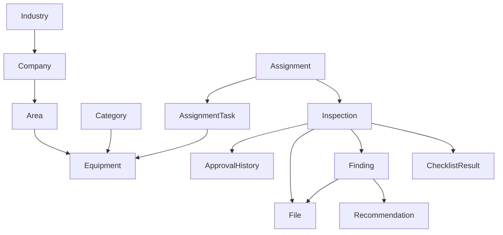

# 1. Equipment Masih Agak Membingungkan

Di dokumen sekarang ada:

```text
Area
 ↓
Equipment
 ↓
Category
```

Padahal secara bisnis:

```text
Category
 └── Equipment
```

Contoh:

```text
Category:
PAA

Equipment:
APAR-01
APAR-02
APAR-03
```

Saya sarankan:

```sql
equipments

id

industry_id
company_id
area_id

category_id

unit_number
serial_number

equipment_name

brand
model

capacity

status
```

Jadi category bukan child dari equipment, tapi foreign key.

---

# 2. Inspection Result Belum Ada

Dari Excel asli:

```text
HASIL PEMERIKSAAN
```

Tetapi belum terlihat jelas pada dokumen.

Tambahkan:

```sql
inspections

id

assignment_id
equipment_id

inspection_date

result

notes

status
```

Enum:

```text
LAIK
TIDAK_LAIK
PERLU_PERBAIKAN
```

Ini nanti jadi sumber dashboard.

---

# 3. Checklist Template Masih Future Ready

Ini justru fitur inti.

Saat ini tertulis:

```text
InspectionAssignment dapat menambahkan inspection checklist
```

Menurut saya jangan future.

Jadikan MVP.

Tambahkan:

```sql
inspection_templates

id
category_id
name
```

---

```sql
inspection_template_items

id
template_id

item_name

is_required
order_number
```

---

Saat inspector inspeksi:

```text
APAR

✓ Tekanan normal
✓ Segel utuh
✓ Label terbaca
✓ Selang tidak retak
```

Daripada ngetik manual.

---

# 4. Recommendation Sebaiknya Tabel Sendiri

Sekarang:

```sql
findings

recommendation
```

Masih string.

Lebih bagus:

```sql
recommendations

id

finding_id

description

status

target_date

created_at
```

Karena nanti bisa:

```text
Temuan
 ├── Rekomendasi 1
 ├── Rekomendasi 2
 └── Rekomendasi 3
```

---

# 5. Equipment Photo & Finding Photo

Saya tetap menyarankan jangan buat:

```sql
equipment_photos
finding_photos
```

Karena kamu sudah punya File Management Module.

Lebih scalable:

```sql
files

id

entity_type
entity_id

media_type

path

thumbnail_path

mime_type

size
```

Contoh:

```text
entity_type = equipment

entity_type = finding

entity_type = inspection
```

Nanti video dan PDF langsung jalan.

---

# 6. Approval History Belum Ada

Saat ini:

```text
Approve
Reject
```

Tapi histori hilang.

Tambahkan:

```sql
inspection_approvals

id

inspection_id

action

comment

performed_by

created_at
```

action:

```text
SUBMITTED
APPROVED
REJECTED
REVISED
```

Ini penting untuk audit.

---

# 7. Assignment Checklist Snapshot

Ini sering dilupakan.

Misalnya:

```text
2026
Checklist APAR = 10 item
```

Lalu:

```text
2027
Checklist APAR = 15 item
```

Kalau inspector membuka inspeksi lama, hasilnya bisa berubah.

Solusi:

Saat assignment dibuat:

```sql
assignment_checklist_items
```

copy dari template.

Jadi histori aman.

---

# 8. Dashboard Masih Kurang

Saya tambahkan:

Supervisor:

```text
Critical Findings
Overdue Assignment
Open Recommendation
```

Admin:

```text
Inspection by Company
Inspection by Area
Inspection by Category
```

---

# Struktur Yang Saya Anggap Final MVP



Kalau Copilot sudah menghasilkan dokumen yang mendekati ini, saya berani bilang desainnya sudah cukup kuat untuk:

* 100.000+ equipment
* 1 juta+ inspection
* puluhan juta foto/file
* multi perusahaan dalam satu sistem
* audit dan histori inspeksi bertahun-tahun

tanpa perlu membongkar database utama lagi.
